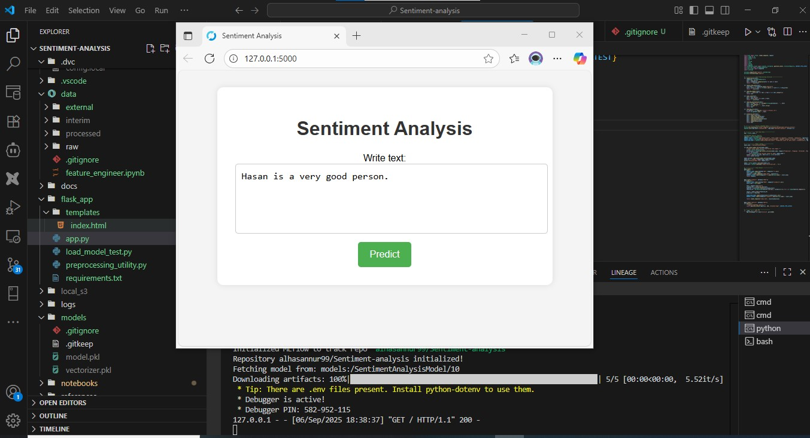
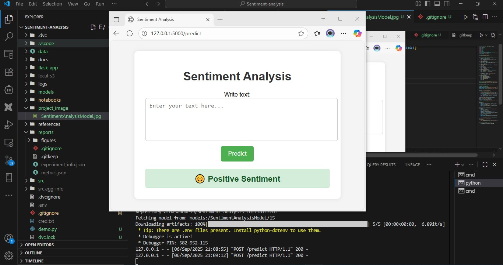
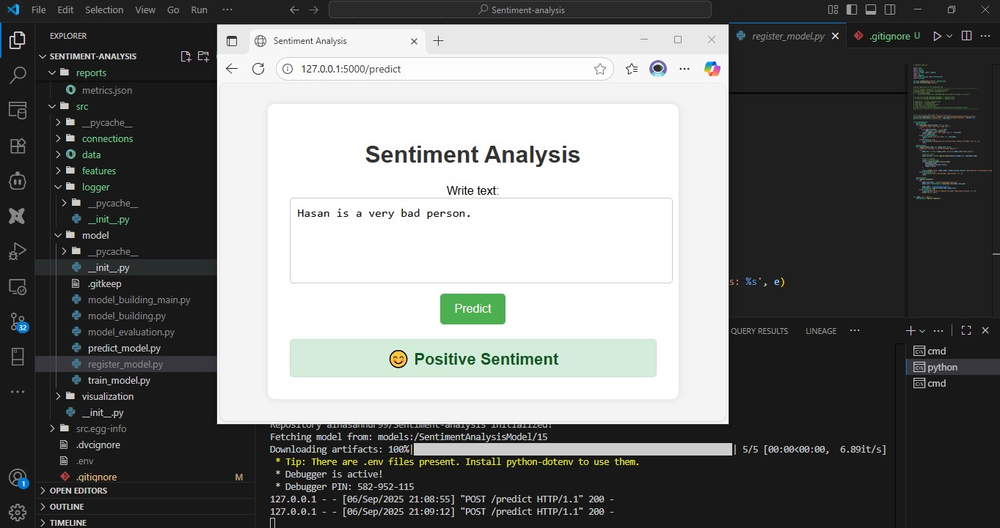
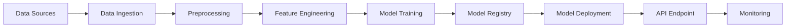
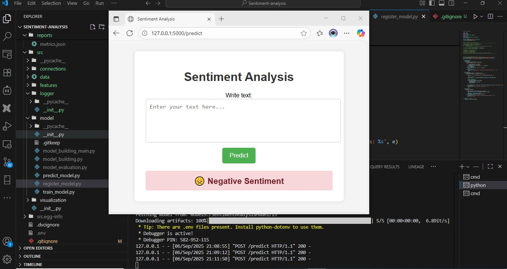
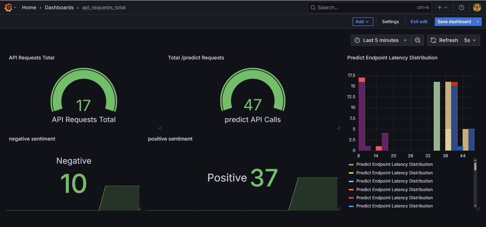

# Sentiment Analysis System 🚀

[](https://opensource.org/licenses/MIT)
[](https://mlflow.org/)
[](https://dvc.org/)
[](https://prometheus.io/)



An end-to-end sentiment analysis solution for extracting insights from text data, featuring a complete MLOps pipeline with data versioning, model tracking, and production deployment.

## Table of Contents
- [Project Overview](#project-overview)
- [Key Features](#key-features)
- [System Architecture](#system-architecture)
- [Technologies Used](#technologies-used)
- [Installation](#installation)
- [Usage](#usage)
- [Project Structure](#project-structure)
- [Testing](#testing)
- [CI/CD Pipeline](#cicd-pipeline)
- [Contributing](#contributing)
- [License](#license)

## Project Overview
This industrial-grade sentiment analysis system provides a production-ready solution for:
- Real-time text sentiment classification
- Batch processing of large text datasets
- Model performance monitoring
- Continuous integration/deployment of ML models

Designed for scalability and maintainability, this solution implements MLOps best practices to ensure reliable model performance in production environments.

## Key Features
- **End-to-End Pipeline**  
    
  Complete workflow from data ingestion to model deployment

- **MLflow Integration**  
  Model versioning, experiment tracking, and registry

- **Data Version Control**  
  Reproducible experiments with DVC

- **Production Monitoring**  
  Real-time metrics with Prometheus and Grafana

- **REST API**  
  Flask-based web service for model inference

- **CI/CD Automation**  
  GitHub Actions for testing and deployment

## System Architecture




## Technologies Used
- **Core Framework**: Python 3.9
- **ML Operations**: MLflow, DVC, Prometheus
- **Machine Learning**: Scikit-learn, NLTK
- **Web Framework**: Flask
- **Data Storage**: Amazon S3
- **CI/CD**: GitHub Actions
- **Documentation**: Sphinx

## Installation
### Prerequisites
- Python 3.9+
- pip 20.0+
- Docker (optional)

### Setup
1. Clone the repository:
```bash
git clone https://github.com/alhasanmolla/Sentiment-analysis.git
cd Sentiment-analysis
```

2. Create virtual environment:
```bash
python -m venv venv
source venv/bin/activate  # Linux/MacOS
venv\Scripts\activate  # Windows
```

3. Install dependencies:
```bash
pip install -r requirements.txt
```

4. Set up environment variables:
```bash
cp .env.example .env
# Edit .env with your configuration
```

## Usage
### Running the Application
Start the Flask development server:
```bash
python flask_app/app.py
```

Access the web interface at `http://localhost:5000`

### Using the API
```bash
curl -X POST http://localhost:5000/predict 
  -H "Content-Type: application/json" 
  -d '{"text": "This product is amazing!"}'
```

### Example Output


### Batch Processing
```bash
python demo.py --input-file data/input.csv --output-file results.csv
```

## Project Structure
```
├── data/                   # Dataset storage
│   ├── external/           # Third-party datasets
│   └── processed/          # Processed data
├── flask_app/              # Production application
│   ├── app.py              # Flask application
│   ├── templates/          # HTML templates
│   └── requirements.txt    # App dependencies
├── models/                 # Trained models
├── notebooks/              # Experimental notebooks
├── src/                    # Source code
│   ├── data/               # Data processing
│   ├── features/           # Feature engineering
│   ├── model/              # Model training
│   └── visualization/      # Visualization utilities
├── tests/                  # Unit tests
├── .github/                # CI/CD workflows
├── docs/                   # Documentation
├── project_image/          # Project visuals
└── ...
```

## Testing
Run test suite:
```bash
pytest tests/
```

Test coverage report:
```bash
pytest --cov=src tests/
```

## CI/CD Pipeline


The GitHub Actions workflow includes:
- Unit testing
- Code quality checks
- Model validation
- Deployment to staging
- Production rollout approval

## Contributing
1. Fork the repository
2. Create your feature branch (`git checkout -b feature/amazing-feature`)
3. Commit your changes (`git commit -m 'Add some amazing feature'`)
4. Push to the branch (`git push origin feature/amazing-feature`)
5. Open a pull request

Please ensure tests pass and documentation is updated.

## License
Distributed under the MIT License. See `LICENSE` for more information.
